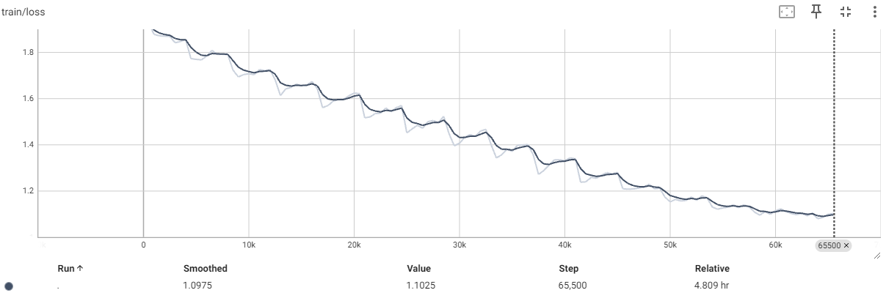

# 공감하는 남친 챗봇(empathy-boyfriend-chatbot)
Polyglot-ko-5.8B 모델을 기반으로 AI허브에 공개된 연인들사이의 공감대화로 QLoRA 파인튜닝한 sLLM 챗봇 모델

## 배경
```
극 T 성향이 강한 개발자인 저는 공감능력이 아주 많이 부족합니다.
그렇게 감정이 매말라가던 도중 [공감 데이터 셋]을 발견하게 되어 
공감능력을 학습한 챗봇에게 조금이나마 도움 받아 미래의 여친에게 도움이 될까 제작하게 되었습니다.
```
*그냥 재밌어보여서 제작했습니다.

***

***

## Update Logs

2024.08.25: 기반 모델을 [🤗EleutherAI/polyglot-ko-5.8b](https://huggingface.co/squarelike/polyglot-ko-medical-5.8b) 에서 [🤗yanolja/EEVE-Korean-10.8B-v1.0](https://huggingface.co/yanolja/EEVE-Korean-10.8B-v1.0)로 변경하여 파인튜닝 진행
2024.08.25: [🤗j5ng/EEVE-korean-empathy-chat-10.8B](https://huggingface.co/j5ng/EEVE-korean-empathy-chat-10.8B) 모델 공개

https://huggingface.co/yanolja/EEVE-Korean-10.8B-v1.0
## 데이터 셋

- 출처 : [AI허브 공감형 대화](https://aihub.or.kr/aihubdata/data/view.do?currMenu=115&topMenu=100&aihubDataSe=data&dataSetSn=71305)
- 활용 데이터: 연인 <br>
*부부, 친구, 연인 등 많은 상황에 데이터가 존재하지만 연인의 데이터만 사용하였습니다.

## 데이터 전처리
1. 상황데이터 제외
2. 감정데이터 제외
3. 대화데이터만 수집
4. 데이터 프레임 형식으로 변환
5. 학습데이터 형식으로 변환
   
## 전처리 데이터 샘플
| role     | text                                                           |
|----------|----------------------------------------------------------------|
| speaker  | 어제 늦게 잤더니 비몽사몽인 채로 출근했어. 출근길에 엉뚱한 버스를 타서 지각할 뻔한 거 있지? 정말 경황이 없더라고.          |
| listener | 놀란 마음에 다급하여 어찌할 바를 몰랐겠다. 지각할 거라는 생각에 마음 졸이기도 했겠어. 마음고생했을 자기를 생각하니 내가 다 속상하네.   |
| speaker  | 매일 출근하는 일상이 똑같은데 버스를 잘 못 타는 건 처음 겪었어. 그래서 더 곤란해서 땀이 삐질삐질 나더라고.              |
| listener | 상상만 해도 진짜 힘들었겠다. 잘 못 탔다는 걸 아는 순간 얼마나 어처구니가 없었겠어. 게다가 출근길이라 더 마음이 조급했을 것 같아. |
| speaker  | 여유롭게 나오긴 했지만 혹시나 지각할까봐 어찌나 당황했던지. 진짜 소리를 지를 뻔한 정도였어.                                  |
| listener | 매일 출근 시간보다 훨씬 이전에 나오는 것도 정말 힘들잖아. 더군다나 버스를 잘못 탔으면 늦을 수도 있었으니 그 순간 마음고생이 심했겠다. |

## 학습 데이터 샘플
```
여친: 어제 늦게 잤더니 비몽사몽인 채로 출근했어. 출근길에 엉뚱한 버스를 타서 지각할 뻔한 거 있지? 정말 경황이 없더라고.
남친: 놀란 마음에 다급하여 어찌할 바를 몰랐겠다. 지각할 거라는 생각에 마음 졸이기도 했겠어. 마음고생했을 자기를 생각하니 내가 다 속상하네.</끝>
여친: 매일 출근하는 일상이 똑같은데 버스를 잘 못 타는 건 처음 겪었어. 그래서 더 곤란해서 땀이 삐질삐질 나더라고.
남친: 상상만 해도 진짜 힘들었겠다. 잘 못 탔다는 걸 아는 순간 얼마나 어처구니가 없었겠어. 게다가 출근길이라 더 마음이 조급했을 것 같아.</끝>
여친: 여유롭게 나오긴 했지만 혹시나 지각할까봐 어찌나 당황했던지. 진짜 소리를 지를 뻔한 정도였어.
남친: 매일 출근 시간보다 훨씬 이전에 나오는 것도 정말 힘들잖아. 더군다나 버스를 잘못 탔으면 늦을 수도 있었으니 그 순간 마음고생이 심했겠다.</끝>
```

## 학습

### Base on Model
 - 기반 모델 : [🤗yanolja/EEVE-Korean-10.8B-v1.0](https://huggingface.co/yanolja/EEVE-Korean-10.8B-v1.0)

```python
import torch
from transformers import AutoTokenizer, AutoModelForCausalLM, BitsAndBytesConfig
from peft import PeftModel

model_id = "EleutherAI/polyglot-ko-5.8b"
bnb_config = BitsAndBytesConfig(
    load_in_4bit=True,
    bnb_4bit_use_double_quant=True,
    bnb_4bit_quant_type="nf4",
    bnb_4bit_compute_dtype=torch.bfloat16
)

tokenizer = AutoTokenizer.from_pretrained(model_id)
model = AutoModelForCausalLM.from_pretrained(model_id, quantization_config=bnb_config, device_map={"":0})
```

### 학습 방법
- 코랩에서 학습 : [Colab](https://colab.research.google.com/drive/1ifjNievplS0qN1fx0wIJfba1C6qZEEVx?usp=sharing)
  <br> *데이터 셋은 AI 허브의 소유권이 있음으로 Private 입니다.

- Epoch: 16
- learning-rate: 3e-4
- batch_size: 1
- Lora r: 8
- Lora target modules: query_key_value



## 사용 방법
- 코랩에서 실행 : [Colab](https://colab.research.google.com/drive/14Cl73ayNjvt9Oiwpk_Gk1pQeCZm2RpN0?usp=sharing)

- WebDemo 실행
```
run.sh
```

## 요구 사항
- 8GB 이상 VRAM

## Thanks to
[jwj7140](https://github.com/jwj7140/ko-medical-chat.git) 님의 저장소 도움을 많이(대부분) 받았습니다.
